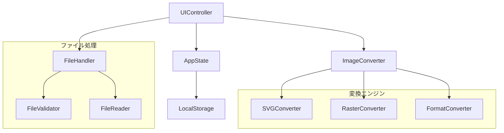

# Design Document

## Overview

既存のSVG to PNG変換ツールを拡張し、SVG、PNG、JPG、WebP、GIF間での相互変換機能を提供する包括的な画像変換アプリケーションを設計します。現在のクラスベース構造を活用しながら、新しい変換エンジンとUIコンポーネントを追加し、レスポンシブデザインを改良します。

## Architecture

### 全体アーキテクチャ



### レイヤー構造

1. **プレゼンテーション層**: UIController、レスポンシブUI
2. **ビジネスロジック層**: ImageConverter、変換エンジン群
3. **データアクセス層**: FileHandler、FileValidator
4. **状態管理層**: AppState、LocalStorage

## Components and Interfaces

### 1. ImageConverter (新規)

多形式画像変換の中核クラス

```javascript
class ImageConverter {
    constructor() {
        this.svgConverter = new SVGConverter();
        this.rasterConverter = new RasterConverter();
        this.formatConverter = new FormatConverter();
        this.supportedFormats = ['svg', 'png', 'jpg', 'jpeg', 'webp', 'gif'];
    }
    
    async convertImage(inputData, fromFormat, toFormat, options) {
        // 変換ルートを決定し、適切なエンジンに委譲
    }
    
    getSupportedConversions(fromFormat) {
        // 入力形式に対してサポートされる出力形式を返す
    }
    
    validateConversion(fromFormat, toFormat) {
        // 変換の妥当性をチェック
    }
}
```

### 2. RasterConverter (新規)

ラスター画像間の変換を担当

```javascript
class RasterConverter {
    async convertRasterToRaster(imageData, fromFormat, toFormat, options) {
        // Canvas APIを使用してラスター画像間変換
    }
    
    async convertToSVG(imageData, options) {
        // ラスター画像をSVGに変換（埋め込み形式）
    }
    
    optimizeForFormat(canvas, format, quality) {
        // 形式に応じた最適化処理
    }
}
```

### 3. FormatConverter (新規)

形式固有の変換処理

```javascript
class FormatConverter {
    async toWebP(canvas, quality) {
        // WebP形式への変換
    }
    
    async toJPEG(canvas, quality, backgroundColor) {
        // JPEG形式への変換（背景色処理含む）
    }
    
    async toPNG(canvas, options) {
        // PNG形式への変換（透明度処理含む）
    }
    
    async toGIF(canvas, options) {
        // GIF形式への変換（制限事項あり）
    }
}
```

### 4. 拡張FileHandler

複数形式のファイル処理をサポート

```javascript
class FileHandler {
    constructor() {
        this.supportedTypes = {
            'svg': ['image/svg+xml', '.svg'],
            'png': ['image/png', '.png'],
            'jpg': ['image/jpeg', '.jpg', '.jpeg'],
            'webp': ['image/webp', '.webp'],
            'gif': ['image/gif', '.gif']
        };
    }
    
    async readImageFile(file) {
        // 形式に応じた読み込み処理
    }
    
    detectImageFormat(file) {
        // ファイル形式の自動検出
    }
    
    validateImageFile(file, expectedFormat) {
        // 画像ファイルの検証
    }
}
```

### 5. 拡張AppState

多形式変換の状態管理

```javascript
class AppState {
    constructor() {
        this.state = {
            // 既存の状態
            currentFile: null,
            originalFormat: null,
            targetFormat: 'png',
            conversionOptions: {
                quality: 90,
                width: null,
                height: null,
                maintainAspectRatio: true,
                backgroundColor: '#ffffff',
                transparentBackground: true
            },
            batchMode: false,
            batchFiles: [],
            conversionHistory: []
        };
    }
}
```

## Data Models

### ConversionJob

```javascript
class ConversionJob {
    constructor(file, fromFormat, toFormat, options) {
        this.id = generateUniqueId();
        this.file = file;
        this.fromFormat = fromFormat;
        this.toFormat = toFormat;
        this.options = options;
        this.status = 'pending'; // pending, processing, completed, failed
        this.result = null;
        this.error = null;
        this.createdAt = new Date();
        this.completedAt = null;
    }
}
```

### ConversionOptions

```javascript
class ConversionOptions {
    constructor() {
        this.quality = 90; // 0-100 (JPEG, WebP用)
        this.width = null; // 出力幅
        this.height = null; // 出力高さ
        this.maintainAspectRatio = true;
        this.backgroundColor = '#ffffff'; // JPEG用背景色
        this.transparentBackground = true; // PNG, WebP用
        this.compressionLevel = 6; // WebP用圧縮レベル
        this.progressive = false; // JPEG用プログレッシブ
    }
}
```

### ImageMetadata

```javascript
class ImageMetadata {
    constructor() {
        this.width = 0;
        this.height = 0;
        this.format = '';
        this.fileSize = 0;
        this.colorDepth = 0;
        this.hasTransparency = false;
        this.colorProfile = null;
        this.dpi = null;
    }
}
```

## Error Handling

### エラー分類

1. **ファイル関連エラー**
   - 不正なファイル形式
   - ファイルサイズ制限超過
   - 読み込みエラー

2. **変換関連エラー**
   - サポートされていない変換
   - メモリ不足
   - 変換処理タイムアウト

3. **品質関連エラー**
   - 無効な品質設定
   - サイズ制限超過

### エラーハンドリング戦略

```javascript
class ConversionError extends Error {
    constructor(message, type, suggestion, originalError) {
        super(message);
        this.type = type;
        this.suggestion = suggestion;
        this.originalError = originalError;
        this.timestamp = new Date();
    }
}

// エラータイプ定数
const ERROR_TYPES = {
    UNSUPPORTED_FORMAT: 'UNSUPPORTED_FORMAT',
    FILE_TOO_LARGE: 'FILE_TOO_LARGE',
    CONVERSION_FAILED: 'CONVERSION_FAILED',
    MEMORY_ERROR: 'MEMORY_ERROR',
    TIMEOUT_ERROR: 'TIMEOUT_ERROR',
    INVALID_OPTIONS: 'INVALID_OPTIONS'
};
```

## Testing Strategy

### 単体テスト

1. **変換エンジンテスト**
   - 各形式間の変換精度
   - エラーハンドリング
   - パフォーマンス

2. **ファイルハンドラーテスト**
   - ファイル形式検出
   - バリデーション
   - 読み込み処理

3. **状態管理テスト**
   - 状態遷移
   - データ整合性

### 統合テスト

1. **変換フローテスト**
   - エンドツーエンド変換
   - バッチ処理
   - エラー回復

2. **UIテスト**
   - レスポンシブ動作
   - ユーザーインタラクション
   - アクセシビリティ

### パフォーマンステスト

1. **大容量ファイル処理**
2. **メモリ使用量監視**
3. **変換速度測定**

## UI/UX Design Improvements

### レスポンシブデザイン強化

#### ブレークポイント戦略

```css
/* モバイルファースト設計 */
/* Base: 320px+ (スマートフォン縦向き) */
/* Small: 480px+ (スマートフォン横向き) */
/* Medium: 768px+ (タブレット縦向き) */
/* Large: 1024px+ (タブレット横向き・小型デスクトップ) */
/* XLarge: 1440px+ (デスクトップ) */
```

#### アダプティブレイアウト

1. **モバイル (320px-767px)**
   - 単一カラムレイアウト
   - 縦積みプレビュー
   - タッチ最適化ボタン
   - スワイプジェスチャー対応

2. **タブレット (768px-1023px)**
   - 2カラムレイアウト
   - サイドバイサイドプレビュー
   - タッチとマウス両対応

3. **デスクトップ (1024px+)**
   - 3カラムレイアウト
   - 詳細オプション表示
   - キーボードショートカット

### 新しいUIコンポーネント

#### 1. FormatSelector

```javascript
class FormatSelector {
    constructor(supportedFormats, currentFormat) {
        this.supportedFormats = supportedFormats;
        this.currentFormat = currentFormat;
        this.element = this.createSelector();
    }
    
    createSelector() {
        // ビジュアル形式選択UI
    }
    
    updateAvailableFormats(fromFormat) {
        // 入力形式に応じて出力形式を更新
    }
}
```

#### 2. QualityController

```javascript
class QualityController {
    constructor(format, defaultQuality) {
        this.format = format;
        this.quality = defaultQuality;
        this.element = this.createController();
    }
    
    createController() {
        // 形式に応じた品質調整UI
    }
    
    updateForFormat(format) {
        // 形式変更時のUI更新
    }
}
```

#### 3. BatchProcessor

```javascript
class BatchProcessor {
    constructor() {
        this.files = [];
        this.element = this.createBatchUI();
    }
    
    addFiles(fileList) {
        // バッチ処理用ファイル追加
    }
    
    processAll(options) {
        // 一括変換処理
    }
}
```

### アクセシビリティ改善

1. **キーボードナビゲーション**
   - Tab順序の最適化
   - ショートカットキー対応

2. **スクリーンリーダー対応**
   - ARIA属性の適切な設定
   - 状態変更の音声通知

3. **視覚的配慮**
   - 高コントラストモード
   - 色覚異常対応

## Performance Optimization

### 変換処理最適化

1. **Web Workers活用**
   - バックグラウンド変換処理
   - UIブロッキング回避

2. **メモリ管理**
   - Canvas要素の適切な破棄
   - 大容量ファイルの分割処理

3. **キャッシュ戦略**
   - 変換結果のローカルキャッシュ
   - プレビュー画像の最適化

### ファイル処理最適化

1. **ストリーミング読み込み**
   - 大容量ファイルの段階的処理
   - プログレス表示

2. **形式検出最適化**
   - ファイルヘッダーによる高速判定
   - MIME type検証

## Security Considerations

### ファイル処理セキュリティ

1. **ファイル検証**
   - マジックナンバーチェック
   - ファイルサイズ制限
   - 悪意のあるコンテンツ検出

2. **メモリ保護**
   - バッファオーバーフロー対策
   - リソース使用量制限

3. **プライバシー保護**
   - ローカル処理の徹底
   - 一時データの確実な削除

## Browser Compatibility

### サポート対象ブラウザ

- **Chrome**: 80+
- **Firefox**: 75+
- **Safari**: 13+
- **Edge**: 80+

### 必要なAPI

1. **Canvas API**: 画像変換処理
2. **File API**: ファイル読み込み
3. **Blob API**: 結果ファイル生成
4. **Web Workers**: バックグラウンド処理
5. **Intersection Observer**: レスポンシブ対応

### フォールバック戦略

1. **WebP非対応ブラウザ**: PNG変換
2. **Web Workers非対応**: メインスレッド処理
3. **古いCanvas API**: 基本機能のみ提供

## Deployment Strategy

### ファイル構成

```
multi-format-converter/
├── index.html              # メインHTML
├── styles/
│   ├── main.css           # メインスタイル
│   ├── responsive.css     # レスポンシブ対応
│   └── themes.css         # テーマ対応
├── scripts/
│   ├── app.js            # アプリケーション初期化
│   ├── state.js          # 状態管理
│   ├── ui-controller.js  # UI制御
│   ├── file-handler.js   # ファイル処理
│   ├── converters/
│   │   ├── image-converter.js
│   │   ├── svg-converter.js
│   │   ├── raster-converter.js
│   │   └── format-converter.js
│   └── utils/
│       ├── validation.js
│       ├── helpers.js
│       └── constants.js
├── assets/
│   ├── icons/
│   └── samples/
└── tests/
    ├── unit/
    └── integration/
```

### 最適化戦略

1. **コード分割**: 機能別モジュール化
2. **遅延読み込み**: 必要時のみ変換エンジン読み込み
3. **圧縮**: CSS/JS minification
4. **キャッシュ**: Service Worker活用