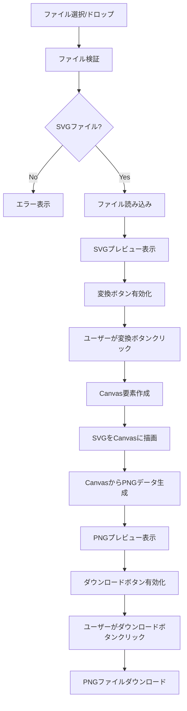

# 設計書

## 概要

SVGからPNGへの変換アプリケーションは、HTML5 Canvas APIを使用してクライアントサイドで変換処理を行うシンプルなWebアプリケーションです。ファイルのアップロード、プレビュー表示、変換処理、ダウンロード機能を提供します。

## アーキテクチャ

### 技術スタック
- **HTML5**: ユーザーインターフェース構造
- **CSS3**: スタイリングとレスポンシブデザイン
- **Vanilla JavaScript**: アプリケーションロジック
- **Canvas API**: SVGからPNGへの変換処理
- **File API**: ファイル読み込み処理
- **Drag and Drop API**: ドラッグ&ドロップ機能

### アプリケーション構造
```
svg-to-png-converter/
├── index.html          # メインHTMLファイル
├── styles.css          # スタイルシート
└── script.js           # JavaScriptロジック
```

## コンポーネントとインターフェース

### HTMLコンポーネント

#### ファイルアップロードエリア
- ファイル入力要素（`<input type="file">`）
- ドラッグ&ドロップゾーン
- アップロード状態表示

#### プレビューエリア
- SVGプレビュー表示領域
- PNGプレビュー表示領域
- ファイル情報表示（名前、サイズ）

#### コントロールエリア
- 出力サイズ選択ドロップダウン
- カスタムサイズ入力フィールド（幅・高さ）
- 透明背景オプションチェックボックス
- 変換ボタン
- ダウンロードボタン
- エラーメッセージ表示領域

### JavaScriptモジュール

#### FileHandler クラス
```javascript
class FileHandler {
  constructor()
  validateFile(file)           // SVGファイル検証
  readFile(file)              // ファイル読み込み
  displayPreview(content)     // プレビュー表示
}
```

#### SVGConverter クラス
```javascript
class SVGConverter {
  constructor()
  convertToCanvas(svgContent, options) // SVGをCanvasに描画（サイズ・透明背景オプション付き）
  canvasToPNG(canvas, transparent)     // CanvasからPNG生成（透明背景オプション付き）
  downloadPNG(pngData, filename)       // PNGダウンロード
  calculateDimensions(originalSize, targetSize) // アスペクト比を維持したサイズ計算
}
```

#### UIController クラス
```javascript
class UIController {
  constructor()
  setupEventListeners()      // イベントリスナー設定
  updateUI(state)           // UI状態更新
  showError(message)        // エラー表示
  showSuccess(message)      // 成功メッセージ表示
}
```

## データモデル

### AppState
```javascript
const appState = {
  currentFile: null,        // 現在のファイル
  svgContent: null,         // SVGコンテンツ
  pngData: null,           // 変換されたPNGデータ
  isConverting: false,     // 変換中フラグ
  error: null,             // エラー情報
  outputSize: 'original',  // 出力サイズ設定
  customWidth: null,       // カスタム幅
  customHeight: null,      // カスタム高さ
  transparentBackground: true // 透明背景オプション（デフォルト：有効）
}
```

### FileInfo
```javascript
const fileInfo = {
  name: string,            // ファイル名
  size: number,            // ファイルサイズ
  type: string,            // MIMEタイプ
  lastModified: number     // 最終更新日時
}
```

## 変換処理フロー



## エラーハンドリング

### エラータイプ
1. **ファイル形式エラー**: SVG以外のファイルが選択された場合
2. **ファイル読み込みエラー**: ファイルの読み込みに失敗した場合
3. **SVG解析エラー**: 無効なSVGコンテンツの場合
4. **変換エラー**: Canvas描画またはPNG生成に失敗した場合
5. **ダウンロードエラー**: ファイルダウンロードに失敗した場合

### エラー処理戦略
- 各エラーに対して具体的なメッセージを表示
- エラー発生時はUI状態をリセット
- ユーザーが再試行できるよう適切なUI状態を維持

## テスト戦略

### 単体テスト
- ファイル検証ロジック
- SVG解析機能
- Canvas変換機能
- UI状態管理

### 統合テスト
- ファイルアップロードからプレビューまでの流れ
- 変換からダウンロードまでの流れ
- エラーハンドリングの動作

### ユーザビリティテスト
- ドラッグ&ドロップの使いやすさ
- エラーメッセージの分かりやすさ
- レスポンシブデザインの動作確認

## パフォーマンス考慮事項

### 最適化戦略
- 大きなSVGファイルの処理時間制限
- Canvas描画の効率化
- メモリ使用量の管理
- プレビュー画像のサイズ制限

### 制限事項
- 最大ファイルサイズ: 10MB
- サポートするSVG機能: 基本的な図形、パス、テキスト
- ブラウザ互換性: モダンブラウザ（Chrome, Firefox, Safari, Edge）

## セキュリティ考慮事項

### クライアントサイド処理
- ファイルはローカルで処理され、サーバーに送信されない
- XSS攻撃を防ぐためのSVGコンテンツサニタイゼーション
- ファイルタイプの厳密な検証

### データ保護
- 処理後のファイルデータは自動的にメモリから削除
- ブラウザのセキュリティポリシーに準拠